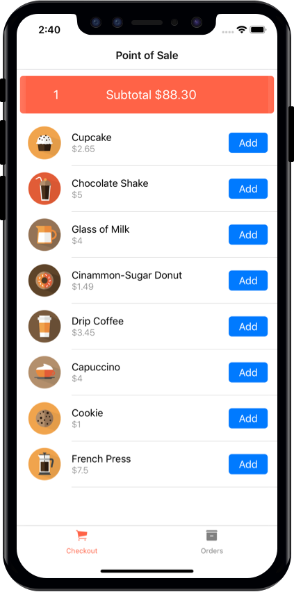
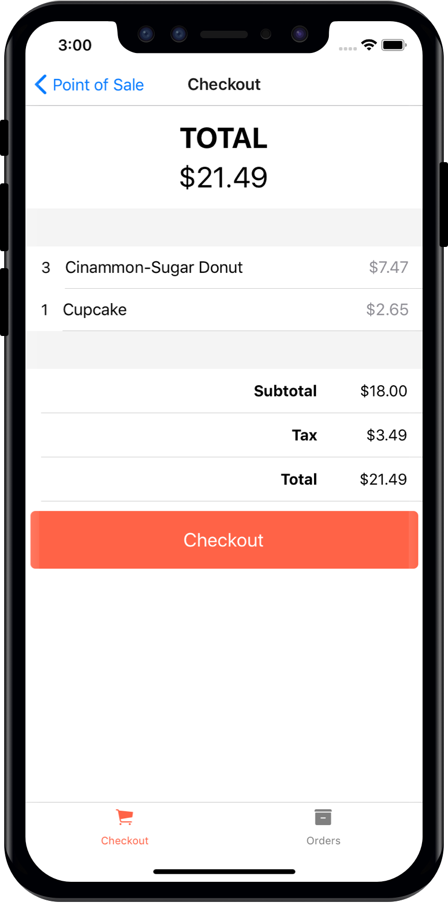

## POS Mobile App with AppSync Offline Delta Sync
This React Native mobile app demonstrates how to leverage the offline and delta sync capabilities from AWS AppSync. It uses the AppSync Client and the AWS Amplify Code Generation to create the queries, mutations and subscription definitions. 

